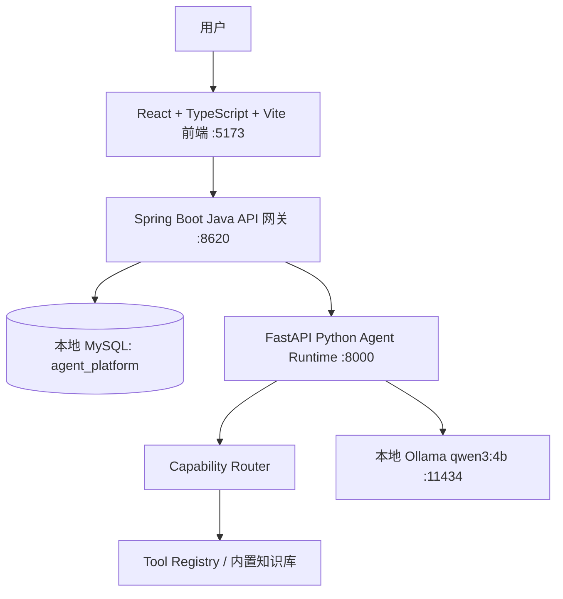

# 超级Agent 平台

这是一个本地可运行的前后端分离 Agent 平台原型。用户登录后在 `超级agent` 中输入自然语言，系统自动判断并执行文字沟通、视频创作、图片创作或知识库检索。

当前默认使用本机 Ollama 模型 `qwen3:4b`。前端只访问 Java 后端；Java 负责用户、会话、图库、知识库、数据库持久化和 API 网关；Python 负责 Agent Runtime、能力路由、工具上下文准备、Trace 和本地 Ollama 调用。

## 当前能力

- 用户登录：普通用户和管理员统一存储，管理员额外可访问管理端接口。
- 文字沟通：由本地 `qwen3:4b` 生成自然语言回复。
- 视频创作：由本地 `qwen3:4b` 生成短视频脚本、分镜、口播和执行建议。
- 图片创作：由本地 `qwen3:4b` 生成图片提示词、风格、构图和负面提示词。
- 知识库检索：先检索内置知识库，再由本地 `qwen3:4b` 基于命中片段生成回答。
- 对话记录：每个用户只看到自己的会话记录，消息和 Run 数据写入 MySQL。
- 图库：每个用户拥有自己的图片库和视频库，支持上传，也保存 Agent 生成记录。
- AI 管理库：每个用户可保存自己的 AI 中转配置，API Key 加密后写入 MySQL。

说明：本版本的图片创作和视频创作是文本产物，不生成真实图片或视频文件。图库中的生成图片/视频记录用于保存本地原型的生成结果元数据。

## 为什么使用 qwen3:4b

本机原模型 `qwen3.5:9b` 运行时提示需要约 `13.7 GiB` 内存，当前机器可用内存不足，无法稳定服务超级Agent。`qwen3:4b` 约 `2.5GB`，更适合当前 16GB 内存环境，能覆盖文字沟通、视频脚本、图片提示词和知识库问答。

## 架构图



## 模块说明

- `frontend/`：React 单页应用，包含登录页、超级agent、知识库、图库、设置和对话记录。
- `backend-java/`：Spring Boot API 网关，负责登录、用户隔离、会话、Run 持久化、图库、知识库、AI Provider 和调用 Python。
- `agent-python/`：FastAPI Agent Runtime，负责能力判断、工具上下文准备、本地 Ollama 调用和 Trace。
- `docs/`：架构与接口补充文档。
- `scripts/`：Windows PowerShell 启动脚本。

## 本地数据库

数据库名称：

```text
agent_platform
```

默认连接：

```text
host: localhost
port: 3306
username: root
password: 123456
database: agent_platform
```

默认种子账号：

```text
普通用户：user / user123
管理员：admin / admin123
```

如果数据库不存在，可执行：

```sql
CREATE DATABASE agent_platform
  DEFAULT CHARACTER SET utf8mb4
  DEFAULT COLLATE utf8mb4_0900_ai_ci;
```

Java 使用 JPA `ddl-auto: update`，启动后会自动补齐实体对应的数据表。

## 本地 Ollama

模型目录必须放在 D 盘：

```text
D:/Ollama/models
```

当前模型：

```text
qwen3:4b
```

知识库向量库使用独立 Milvus 服务，不挂在当前项目进程中。默认读取以下环境变量：

```text
KNOWLEDGE_MILVUS_HOST=127.0.0.1
KNOWLEDGE_MILVUS_PORT=19530
KNOWLEDGE_MILVUS_COLLECTION=knowledge_chunks
KNOWLEDGE_VECTOR_DIM=384
```

说明：Milvus 需像 MySQL、Redis 一样提前启动并保持可用，当前 `start-dev.ps1` 不负责拉起 Milvus。

## 本机独立 Milvus 配置清单

建议把 Milvus 当成独立基础设施处理，而不是项目内服务。当前项目侧至少需要准备以下配置：

```text
服务地址
- KNOWLEDGE_MILVUS_HOST=127.0.0.1
- KNOWLEDGE_MILVUS_PORT=19530

Collection
- KNOWLEDGE_MILVUS_COLLECTION=knowledge_chunks
- KNOWLEDGE_MILVUS_METRIC_TYPE=COSINE
- KNOWLEDGE_MILVUS_INDEX_TYPE=IVF_FLAT
- KNOWLEDGE_VECTOR_DIM=384

Embedding
- KNOWLEDGE_EMBEDDING_PROVIDER=hash 或 ollama
- KNOWLEDGE_EMBEDDING_MODEL=nomic-embed-text

OCR
- KNOWLEDGE_OCR_LANG=chi_sim+eng
- 本机需安装 Tesseract，并保证 tesseract 已加入 PATH
```

建议启动前人工检查：

```powershell
Test-NetConnection 127.0.0.1 -Port 19530
Invoke-RestMethod http://localhost:8000/agent/knowledge/health
Invoke-RestMethod http://localhost:8620/api/health
tesseract --version
```

说明：当前原型已支持 TXT、Markdown、DOCX、图片 OCR 和可提取文本的 PDF。扫描版 PDF 的 OCR 回退还没有做成完整流水线，首期会返回明确错误提示。

本地原型默认限制上下文窗口：

```text
OLLAMA_NUM_CTX=4096
```

这样可以避免 `qwen3:4b` 按超大上下文加载时占用过多内存。

启动前检查：

```powershell
ollama serve
ollama list
```

`ollama list` 应包含：

```text
qwen3:4b
```

如果 Ollama 未启动或模型不存在，Agent Run 会返回失败状态和明确 Trace，不会静默降级为 Mock。

## 启动步骤

### 1. 启动 Python Agent 服务

```powershell
cd D:/超级进步/项目/my-super-project/agent-python
python -m venv .venv
.\.venv\Scripts\Activate.ps1
pip install -r requirements.txt
$env:OLLAMA_MODELS="D:\Ollama\models"
$env:OLLAMA_NUM_CTX="4096"
$env:PYTHONIOENCODING="utf-8"
$env:KNOWLEDGE_MILVUS_HOST="127.0.0.1"
$env:KNOWLEDGE_MILVUS_PORT="19530"
uvicorn app.main:app --host 127.0.0.1 --port 8000
```

健康检查：

```text
http://localhost:8000/health
```

响应中会包含：

```json
{
  "status": "ok",
  "service": "agent-python",
  "llm": {
    "provider": "ollama",
    "model": "qwen3:4b",
    "baseUrl": "http://localhost:11434",
    "available": true
  },
  "knowledge": {
    "status": "ok"
  }
}
```

### 2. 启动 Java 后端

确认本地 MySQL 已启动，并存在 `agent_platform` 数据库。

```powershell
cd D:/超级进步/项目/my-super-project/backend-java
mvn spring-boot:run
```

默认地址：

```text
http://localhost:8620
```

### 3. 启动前端

```powershell
cd D:/超级进步/项目/my-super-project/frontend
npm install
npm run dev
```

默认地址：

```text
http://localhost:5173
```

## 一键启动

Windows 下可以使用脚本同时启动三端：

```powershell
cd D:/超级进步/项目/my-super-project
powershell -ExecutionPolicy Bypass -File scripts/start-dev.ps1
```

脚本会分别打开：

```text
SuperAgent Python Runtime :8000
SuperAgent Java API :8620
SuperAgent Frontend :5173
```

如果前端提示 `Python Agent 服务未启动`，优先查看 `SuperAgent Python Runtime :8000` 窗口日志。
如果前端提示 `知识库向量服务不可用`，优先检查独立 Milvus 服务与 `http://localhost:8000/agent/knowledge/health`。

## 常见问题

### Python Agent service unavailable

现象：

```text
Python Agent service is unavailable
Connection refused
http://localhost:8000/agent/runs
```

原因：Java 后端已经启动，但 Python Agent `:8000` 没有运行。

检查：

```powershell
Get-NetTCPConnection -LocalPort 8000,8620
Invoke-RestMethod http://localhost:8000/health
Invoke-RestMethod http://localhost:8620/api/health
```

修复：

```powershell
cd D:/超级进步/项目/my-super-project/agent-python
.\.venv\Scripts\Activate.ps1
$env:OLLAMA_MODELS="D:\Ollama\models"
$env:OLLAMA_NUM_CTX="4096"
$env:PYTHONIOENCODING="utf-8"
uvicorn app.main:app --host 127.0.0.1 --port 8000
```

## 环境变量

`.env.example` 保留本地默认值：

```env
LLM_PROVIDER=ollama
OLLAMA_BASE_URL=http://localhost:11434
OLLAMA_MODEL=qwen3:4b
OLLAMA_TIMEOUT_SECONDS=60
OLLAMA_NUM_CTX=4096
JAVA_API_PORT=8620
AGENT_SERVICE_URL=http://localhost:8000
AGENT_INTERNAL_TOKEN=change_me_internal_agent_token
AGENT_CONNECT_TIMEOUT_MS=3000
AGENT_READ_TIMEOUT_MS=120000
VITE_API_BASE_URL=http://localhost:8620
MYSQL_URL=jdbc:mysql://localhost:3306/agent_platform?useSSL=false&allowPublicKeyRetrieval=true&serverTimezone=UTC&characterEncoding=utf8
MYSQL_USER=root
MYSQL_PASSWORD=123456
AI_KEY_SECRET=change_me_for_local_dev
UPLOAD_STORAGE_ROOT_DIR=storage/uploads
UPLOAD_MAX_FILE_SIZE=200MB
UPLOAD_MAX_REQUEST_SIZE=220MB
UPLOAD_MAX_IMAGE_BYTES=10485760
UPLOAD_MAX_VIDEO_BYTES=209715200
UPLOAD_MAX_DOCUMENT_BYTES=20971520
AGENT_MAX_IMAGE_BYTES=10485760
AGENT_MAX_DOCUMENT_BYTES=20971520
OPENAI_API_KEY=
OPENAI_BASE_URL=
OPENAI_MODEL=
```

`OPENAI_*` 字段只作为未来扩展预留，当前默认路径是本地 Ollama。

## API 边界

前端只允许调用 Java `/api/*`，不直接访问 Python 或 Ollama。

| Method | Path | 说明 |
|---|---|---|
| GET | `/api/health` | Java 健康检查，并透传 Python/Ollama 状态 |
| POST | `/api/auth/login` | 登录并返回 Bearer Token |
| POST | `/api/auth/logout` | 注销当前登录会话 |
| GET | `/api/auth/me` | 查询当前登录用户 |
| POST | `/api/conversations` | 创建当前用户的对话 |
| GET | `/api/conversations` | 查询当前用户的对话记录 |
| GET | `/api/conversations/{conversationId}/messages` | 查询单个对话的消息 |
| GET | `/api/capabilities` | 查询 Agent 支持的能力 |
| POST | `/api/agent-runs` | 创建 Agent Run，并关联当前对话 |
| GET | `/api/agent-runs/{runId}` | 查询 Run 详情 |
| GET | `/api/traces/{runId}` | 查询 Run Trace |
| POST/GET | `/api/knowledge-bases` | 创建/查询当前用户知识库 |
| POST/GET/PUT/DELETE | `/api/ai-providers` | 管理当前用户 AI 中转配置 |
| POST | `/api/assets/images` | 上传图片并写入当前用户图库 |
| GET | `/api/assets/images` | 查询当前用户图片库 |
| GET | `/api/assets/videos` | 查询当前用户视频库 |
| POST | `/api/assets/videos/upload` | 上传视频并写入当前用户图库 |

Java 调用 Python：

| Method | Path | 说明 |
|---|---|---|
| GET | `/health` | Python/Ollama 健康检查 |
| GET | `/agent/capabilities` | 查询 Agent 能力定义 |
| POST | `/agent/runs` | 执行 Agent Run |
| GET | `/agent/runs/{runId}` | 查询 Python Run |
| GET | `/agent/traces/{runId}` | 查询 Python Trace |
| POST | `/agent/assets/images` | Python 图片资产接收 |

## 构建验证

```powershell
cd D:/超级进步/项目/my-super-project/agent-python
python -m compileall app
```

```powershell
cd D:/超级进步/项目/my-super-project/backend-java
mvn -q -DskipTests package
```

后端测试使用 `test` profile 和 H2 内存库 `autotest_agent_platform`，不会连接或修改本机 MySQL：

```powershell
cd D:/超级进步/项目/my-super-project/backend-java
mvn test
```

```powershell
cd D:/超级进步/项目/my-super-project/frontend
npm run build
```

## Knowledge upload status

Knowledge document upload returns after the original file is stored and a document record is created. Indexing runs asynchronously in the Java backend:

```text
QUEUED/PENDING -> PROCESSING/INDEXING -> COMPLETED/INDEXED
FAILED/FAILED with errorReason on errors
```

Use `GET /api/knowledge-bases/{id}/documents` to refresh document status and chunk count.
