# 超级 Agent 平台仓库级业务文档

> 分析日期：2026-05-18  
> 文档范围：基于当前仓库源码、配置与现有 `README.md`/`docs` 资料整理。本文面向业务、产品、测试和后端协作人员，重点解释服务做什么、怎么流转、有哪些接口边界，以及当前代码审计结论。

## 1. 业务场景

本仓库实现的是一个本地可运行的「超级 Agent 平台」原型。用户登录后，可以在前端工作台通过自然语言发起任务，平台会把请求路由到四类能力：

| 能力 | 业务含义 | 当前产物 |
|---|---|---|
| `TEXT_CHAT` | 普通文字问答、解释、总结和对话 | 模型生成的文本回复 |
| `IMAGE_CREATION` | 图片创作方案、海报/封面/插画提示词 | 文本形式的图片提示词、构图、风格、负面提示词 |
| `VIDEO_CREATION` | 短视频脚本、分镜、口播与执行建议 | 文本形式的视频脚本和分镜方案 |
| `KNOWLEDGE_RETRIEVAL` | 基于用户知识库文档检索并回答 | Milvus 命中文档片段 + 模型生成答案 |

平台采用前后端分离和服务拆分：

- 前端只调用 Java 后端的 `/api/*`。
- Java 后端是统一 API 网关和业务持久化层，负责用户、会话、运行记录、图库、知识库、AI Provider 配置和文件存储。
- Python 服务是内部 Agent Runtime，负责能力路由、工具上下文、LLM 调用、知识库解析/向量检索和 Trace 生成。
- 默认 LLM 是本机 Ollama `qwen3:4b`，也支持用户在设置页配置外部 OpenAI-compatible、OpenAI Responses 或 Anthropic Messages 协议的模型供应商。

业务边界需要特别注意：当前图片创作和视频创作不会生成真实图片或视频文件，图库中的「生成记录」是元数据记录；真实媒体生成需要后续接入图片/视频生成服务。

## 2. 项目结构分析

```text
my-super-project/
├─ frontend/                 React + TypeScript + Vite 单页应用
│  ├─ src/api.ts             前端唯一 API 客户端，统一带 Bearer Token
│  ├─ src/main.tsx           登录、工作台、对话、知识库、图库主界面
│  ├─ src/admin/             管理台：总览、用户、运行记录
│  └─ src/settings/          AI Provider 配置界面
├─ backend-java/             Spring Boot API 网关与业务持久化
│  ├─ controller/            Java 对外 REST API
│  ├─ service/               鉴权、Run、会话、知识库、Provider、文件等业务服务
│  ├─ model/                 JPA 实体与 API 模型
│  ├─ dto/                   请求/响应 DTO
│  └─ resources/             application.yml 配置
├─ agent-python/             FastAPI Agent Runtime
│  ├─ app/main.py            Python 内部 API 入口
│  ├─ app/core/runtime.py    Agent Run 编排
│  ├─ app/core/llm.py        Ollama/外部 Provider 调用
│  ├─ app/core/knowledge_*   文档解析、Embedding、Milvus 检索
│  └─ app/tools/registry.py  工具上下文构造
├─ docs/                     早期架构、接口、Milvus 配置说明
├─ scripts/                  Windows 本地启动脚本
├─ docker-compose.yml        MySQL、Redis、Milvus、etcd、MinIO 本地依赖
└─ README.md                 本地启动、默认账号、环境变量说明
```

### 2.1 前端职责

前端承担业务操作界面，不保存核心业务状态：

- 登录态：Token 存在 `localStorage` 的 `super_agent_token`。
- 工作台：新建/打开会话、发送消息、选择知识库、上传参考图片。
- 知识库：创建知识库、上传文档、查看解析/索引状态、检索测试。
- 图库：上传图片/视频、查看上传或生成记录。
- 设置：管理 AI Provider、测试连接、查看能力到 Provider 的生效映射。
- 管理台：管理员查看系统总览、用户管理和 Agent Run 记录。

### 2.2 Java 后端职责

Java 后端是业务侧最重要的服务边界：

- 鉴权：Token 登录态、普通用户/管理员角色判断。
- 用户隔离：绝大多数查询都以 `userId` 作为条件。
- 会话：保存用户消息、助手消息、会话标题、最近 Run 和会话记忆摘要。
- Agent Run：组装请求、补充知识库命中和会话记忆、解析 Provider、调用 Python、保存 Run 明细。
- 知识库：保存知识库与文档元数据，异步触发 Python 索引，保存 chunk 元数据。
- 文件：将上传文件保存到 `storage/uploads/{userId}/{assetType}/`。
- AI Provider：加密保存 API Key，按能力选择外部 Provider，连接测试。
- 管理台：跨用户统计、查询用户和运行记录。

### 2.3 Python Agent 职责

Python 服务是内部运行时，不对前端开放：

- 校验 `X-Internal-Token`。
- 根据消息、图片、知识库开关和能力提示进行能力路由。
- 构造工具输出和 Artifact。
- 调用本地 Ollama 或 Java 注入的外部 Provider 配置。
- 解析知识库文件、生成向量、写入/搜索 Milvus。
- 返回 Run、Trace、知识库索引和搜索结果。

## 3. 关键概念

| 概念 | 所在层 | 说明 |
|---|---|---|
| User | Java | 登录主体，角色为 `USER` 或 `ADMIN`，状态为 `ACTIVE`/`DISABLED`。 |
| UserSession | Java | 登录会话。前端持有明文 token，数据库保存 token hash。默认有效期 7 天。 |
| Conversation | Java | 用户的一段对话。保存标题、首条消息、最近 Run、记忆摘要。 |
| ConversationMessage | Java | 会话内消息，包含 `USER`/`ASSISTANT`、内容、能力、runId。 |
| Capability | Java/Python/前端 | Agent 能力枚举：文字、图片、视频、知识库。 |
| AgentRun | Java/Python | 一次 Agent 任务运行。包含能力、状态、步骤、工具调用、Trace、Artifact、最终结果。 |
| AgentStep | Python | Run 内部执行步骤，例如路由、上下文准备、LLM 生成。 |
| ToolCall | Python | 工具调用记录。当前工具主要构造上下文，不执行真实媒体生成。 |
| Artifact | Python | Run 产物数据结构，例如文本回复、脚本、图片提示词、知识库回答。 |
| TraceEvent | Python/Java | 运行链路事件，用于前端和管理台展示诊断信息。 |
| KnowledgeBase | Java | 用户知识库容器。 |
| KnowledgeDocument | Java | 上传到知识库的文档元数据，保存解析和索引状态。 |
| KnowledgeChunk | Java/Python/Milvus | 文档切分后的片段。Java 保存元数据，Milvus 保存向量与检索字段。 |
| FileAsset | Java | 上传文件或生成记录的统一文件元数据。 |
| ImageAsset/VideoAsset | Java | 图库业务记录，区分 `UPLOAD`/`GENERATED` 或 `UPLOADED`/`GENERATED`。 |
| AI Provider | Java/Python | 用户配置的外部模型供应商。Java 保存和解析，Python 使用配置发起模型调用。 |
| Provider Preset | Java/前端 | 预置 Provider 模板，如 DeepSeek、Qwen、OpenAI、Anthropic、OpenRouter 等。 |
| Internal Token | Java/Python | Java 调 Python 的内部认证头 `X-Internal-Token`。 |

## 4. 系统架构图

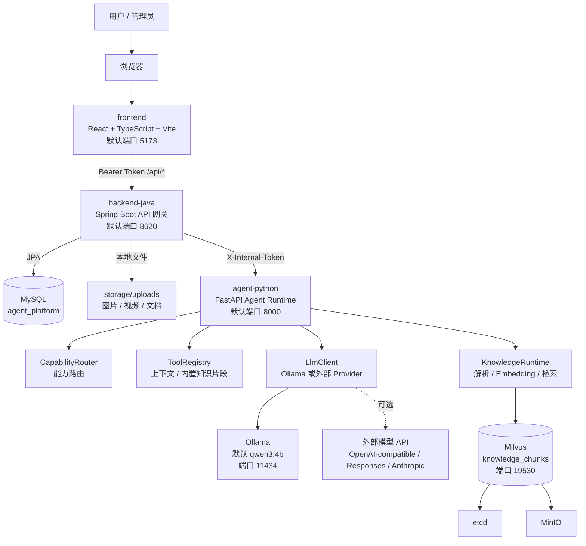

架构原则：

- 前端不直接访问 Python、Ollama、Milvus 或外部模型。
- Java 是唯一对外 API 面，负责鉴权、用户隔离和持久化。
- Python 是内部 Agent 执行与知识库向量能力服务。
- MySQL 保存业务事实，Milvus 保存知识库向量索引，文件系统保存上传原始文件。

## 5. 仓库调用链图

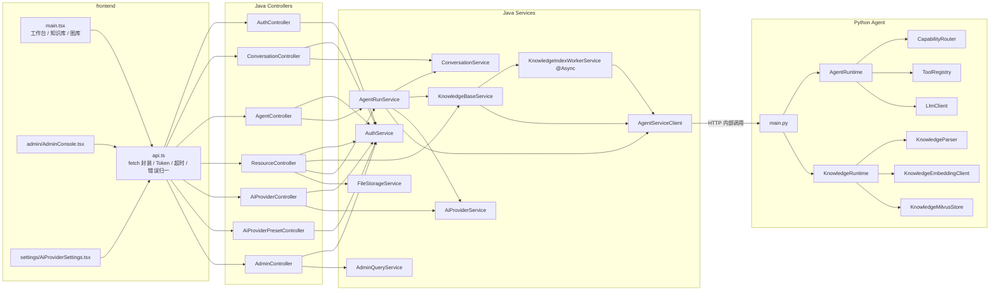

## 6. 关键业务流程

### 6.1 登录与鉴权

1. 前端调用 `POST /api/auth/login`，提交用户名和密码。
2. Java 读取 `users` 表，校验用户状态和密码 hash。
3. 校验成功后生成随机 token，数据库保存 token hash 到 `user_sessions`。
4. 前端保存 token，后续请求通过 `Authorization: Bearer <token>` 访问 Java。
5. Java 每个需要登录的接口都调用 `AuthService.requireUser()`；管理员接口调用 `requireAdmin()`。

### 6.2 对话与 Agent Run

1. 用户在工作台新建会话或复用已有会话。
2. 用户输入消息，可选上传参考图片，可选选择知识库。
3. 前端调用 `POST /api/agent-runs`。
4. Java 校验会话归属、补充知识库命中、准备最近消息和会话摘要。
5. Java 根据能力推断并解析用户生效的 AI Provider 配置。
6. Java 通过 `AgentServiceClient` 调用 Python `/agent/runs`。
7. Python 进行能力路由，执行工具上下文构造，调用 LLM，返回 Run。
8. Java 保存 Run 主表和明细 JSON，写入用户消息和助手消息。
9. 如果 Run 是图片或视频创作，Java 额外创建图库生成记录。

### 6.3 知识库上传、索引与检索

1. 用户创建知识库。
2. 用户上传 TXT、Markdown、PDF、DOCX 或图片。
3. Java 保存原始文件到本地文件系统，创建 `KnowledgeDocument`，状态为 `QUEUED/PENDING`。
4. Java 异步 worker 读取文件并调用 Python `/agent/knowledge/index`。
5. Python 解析文档，切分 chunk，生成 embedding，写入 Milvus。
6. Java 保存 chunk 元数据，并把文档状态改为 `COMPLETED/INDEXED`；失败则标记为 `FAILED` 并写入错误原因。
7. 检索时 Java 调 Python `/agent/knowledge/search`，Python 计算查询向量并在 Milvus 中按 `user_id + knowledge_base_id` 搜索。
8. Agent Run 如果启用知识库，会先执行检索，把命中片段放入 Python 工具上下文，再由 LLM 生成答案。

### 6.4 图库与文件资产

1. 图片上传走 `POST /api/assets/images`，Java 和 Python 都校验图片类型；Java 保存文件，创建 `FileAsset` 和 `ImageAsset`。
2. 视频上传走 `POST /api/assets/videos/upload`，Java 校验视频类型和大小，保存文件并创建 `VideoAsset`。
3. 图片/视频创作 Run 成功后，Java 创建 `GENERATED` 记录，但当前没有真实文件。
4. 文件内容读取通过 `GET /api/assets/files/{fileAssetId}/content`，Java 校验文件属于当前用户并从存储目录流式返回。

### 6.5 AI Provider 配置与生效

1. 用户在设置页选择预设或手动填写外部模型服务。
2. Java 校验协议、Base URL、模型、能力范围和 JSON 配置。
3. API Key 使用 AES-GCM 加密后保存到 `ai_providers`。
4. 连接测试由 Java 端协议适配器发起。
5. 创建 Run 时，Java 按能力优先选择精确能力 Provider，其次选择 `ALL` Provider。
6. 如果启用 fallback，Java 将备用 Provider 配置一并注入 Python。
7. Python 优先调用主 Provider；仅在超时、限流、服务端不可用等可重试错误时尝试 fallback。
8. 未配置外部 Provider 时，Python 使用本地 Ollama。

### 6.6 管理台

1. 管理员登录后默认进入管理台。
2. 管理台总览聚合用户数、知识库数、文档数、图库数量、近 24 小时运行和失败运行。
3. 管理员可创建、编辑、删除用户，并可防止删除/禁用/降级当前管理员自身。
4. 管理员可跨用户查看 Run 记录、Run 详情和 Trace。

## 7. API 清单

### 7.1 Java 对外 API

| Method | Path | Controller | 登录 | 业务说明 |
|---|---|---|---|---|
| `GET` | `/` | `HomeController` | 否 | API 欢迎页。 |
| `GET` | `/api/health` | `AgentController` | 否 | Java 健康检查，并探测 Python/Ollama/知识库健康状态。 |
| `POST` | `/api/auth/login` | `AuthController` | 否 | 登录，返回 Bearer Token 和用户信息。 |
| `POST` | `/api/auth/logout` | `AuthController` | 是 | 注销当前 token。 |
| `GET` | `/api/auth/me` | `AuthController` | 是 | 返回当前用户信息。 |
| `POST` | `/api/conversations` | `ConversationController` | 是 | 创建会话。 |
| `GET` | `/api/conversations` | `ConversationController` | 是 | 查询当前用户会话列表。 |
| `GET` | `/api/conversations/{conversationId}` | `ConversationController` | 是 | 查询当前用户单个会话。 |
| `GET` | `/api/conversations/{conversationId}/messages` | `ConversationController` | 是 | 查询会话消息。 |
| `GET` | `/api/capabilities` | `AgentController` | 否 | 从 Python 获取能力定义。 |
| `POST` | `/api/agent-runs` | `AgentController` | 是 | 创建并执行 Agent Run。 |
| `GET` | `/api/agent-runs` | `AgentController` | 是 | 查询当前用户 Run 列表。 |
| `GET` | `/api/agent-runs/{runId}` | `AgentController` | 是 | 查询当前用户 Run 详情。 |
| `GET` | `/api/traces/{runId}` | `AgentController` | 是 | 查询当前用户 Run Trace，并尝试从 Python 刷新。 |
| `POST` | `/api/assets/images` | `AgentController` | 是 | 上传图片，保存文件和图库记录。 |
| `POST` | `/api/knowledge-bases` | `ResourceController` | 是 | 创建知识库。 |
| `GET` | `/api/knowledge-bases` | `ResourceController` | 是 | 查询当前用户知识库。 |
| `DELETE` | `/api/knowledge-bases/{id}` | `ResourceController` | 是 | 删除知识库、文档、chunk 和原始文件。 |
| `GET` | `/api/knowledge-bases/{id}/documents` | `ResourceController` | 是 | 查询知识库文档和索引状态。 |
| `POST` | `/api/knowledge-bases/{id}/documents/upload` | `ResourceController` | 是 | 上传文档并异步索引。 |
| `POST` | `/api/knowledge-bases/{id}/search` | `ResourceController` | 是 | 检索指定知识库。 |
| `GET` | `/api/assets/images` | `ResourceController` | 是 | 查询图片库。 |
| `GET` | `/api/assets/videos` | `ResourceController` | 是 | 查询视频库。 |
| `POST` | `/api/assets/videos` | `ResourceController` | 是 | 创建视频元数据记录。 |
| `POST` | `/api/assets/videos/upload` | `ResourceController` | 是 | 上传视频文件。 |
| `GET` | `/api/assets/files/{assetType}` | `ResourceController` | 是 | 查询当前用户某类文件资产。 |
| `GET` | `/api/assets/files/{fileAssetId}/content` | `ResourceController` | 是 | 读取当前用户文件内容。 |
| `GET` | `/api/ai-provider-presets` | `AiProviderPresetController` | 是 | 查询 Provider 预设。 |
| `GET` | `/api/ai-providers` | `AiProviderController` | 是 | 查询当前用户 Provider 配置。 |
| `POST` | `/api/ai-providers` | `AiProviderController` | 是 | 创建 Provider。 |
| `PUT` | `/api/ai-providers/{id}` | `AiProviderController` | 是 | 更新 Provider。 |
| `DELETE` | `/api/ai-providers/{id}` | `AiProviderController` | 是 | 删除 Provider。 |
| `POST` | `/api/ai-providers/{id}/test` | `AiProviderController` | 是 | 测试 Provider 连接。 |
| `GET` | `/api/ai-providers/effective` | `AiProviderController` | 是 | 查询各能力当前生效 Provider。 |
| `GET` | `/api/admin/dashboard` | `AdminController` | 管理员 | 管理台总览。 |
| `GET` | `/api/admin/users` | `AdminController` | 管理员 | 用户分页查询。 |
| `POST` | `/api/admin/users` | `AdminController` | 管理员 | 创建用户。 |
| `PUT` | `/api/admin/users/{userId}` | `AdminController` | 管理员 | 更新用户。 |
| `DELETE` | `/api/admin/users/{userId}` | `AdminController` | 管理员 | 删除用户。 |
| `GET` | `/api/admin/agent-runs` | `AdminController` | 管理员 | 跨用户查询 Run。 |
| `GET` | `/api/admin/agent-runs/{runId}` | `AdminController` | 管理员 | 查询任意 Run 详情。 |
| `GET` | `/api/admin/agent-runs/{runId}/traces` | `AdminController` | 管理员 | 查询任意 Run Trace。 |

### 7.2 Python 内部 API

| Method | Path | 鉴权 | 业务说明 |
|---|---|---|---|
| `GET` | `/health` | 否 | Python、LLM、知识库健康状态。 |
| `GET` | `/agent/knowledge/health` | `X-Internal-Token` | 知识库能力健康检查。 |
| `POST` | `/agent/knowledge/index` | `X-Internal-Token` | 解析文档、生成向量、写入 Milvus。 |
| `POST` | `/agent/knowledge/search` | `X-Internal-Token` | 查询向量检索。 |
| `GET` | `/agent/capabilities` | `X-Internal-Token` | 能力定义列表。 |
| `POST` | `/agent/assets/images` | `X-Internal-Token` | 接收图片并返回图片资产元数据。 |
| `POST` | `/agent/runs` | `X-Internal-Token` | 执行 Agent Run。 |
| `POST` | `/agent/memory/summarize` | `X-Internal-Token` | 压缩会话记忆。 |
| `GET` | `/agent/runs/{runId}` | `X-Internal-Token` | 查询 Python 内存中的 Run。 |
| `GET` | `/agent/traces/{runId}` | `X-Internal-Token` | 查询 Python 内存中的 Trace。 |

## 8. 各接口逻辑时序图

### 8.1 健康检查：`GET /api/health`

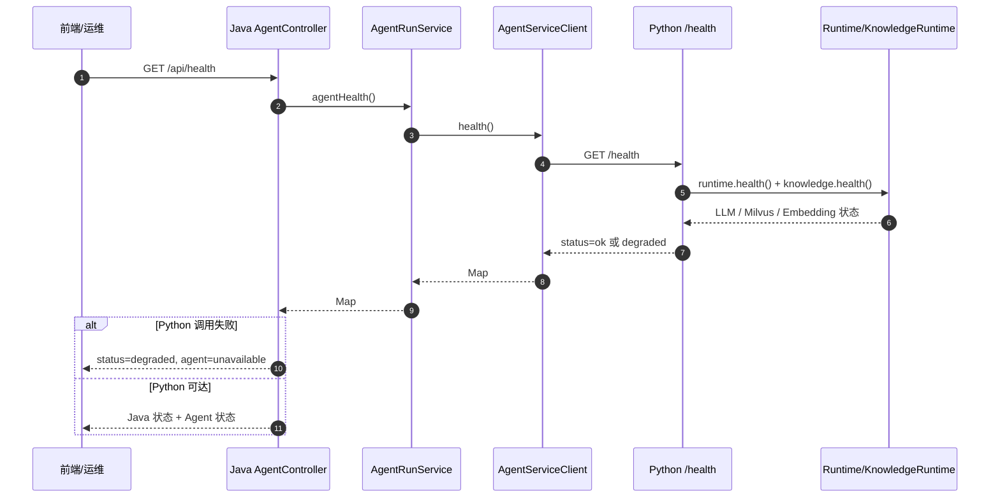

### 8.2 鉴权接口：`POST /api/auth/login`、`POST /api/auth/logout`、`GET /api/auth/me`

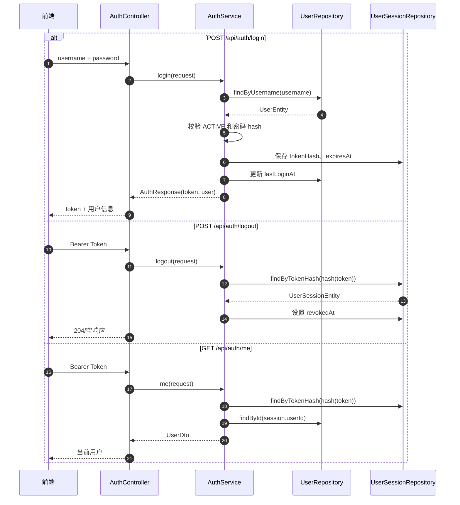

### 8.3 会话接口：`/api/conversations`

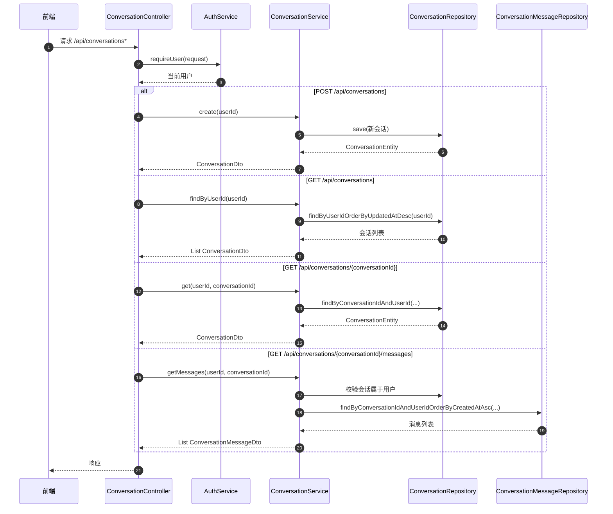

### 8.4 能力与 Agent Run 接口：`GET /api/capabilities`、`POST /api/agent-runs`、`GET /api/agent-runs*`、`GET /api/traces/{runId}`、`POST /api/assets/images`

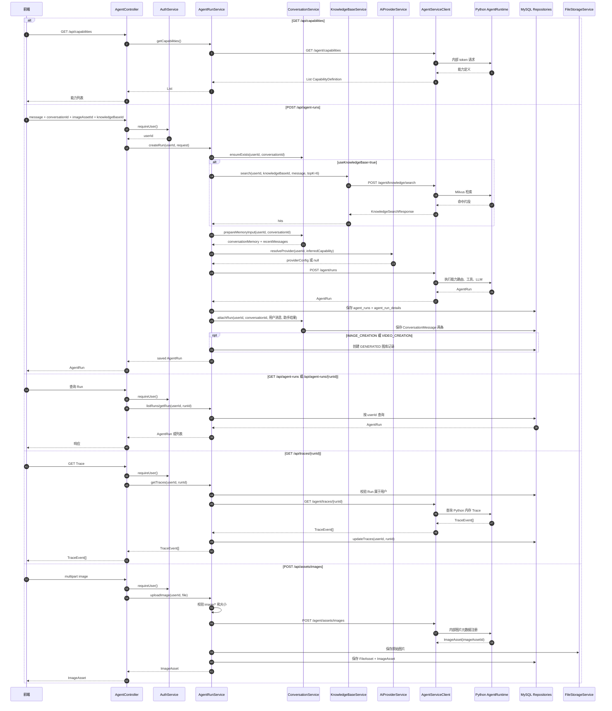

### 8.5 Python Run 内部执行：`POST /agent/runs`

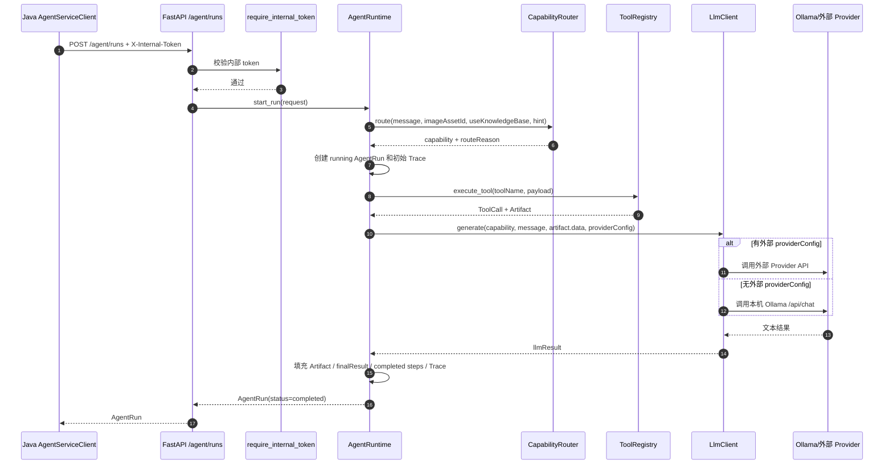

### 8.6 知识库接口：`/api/knowledge-bases*`

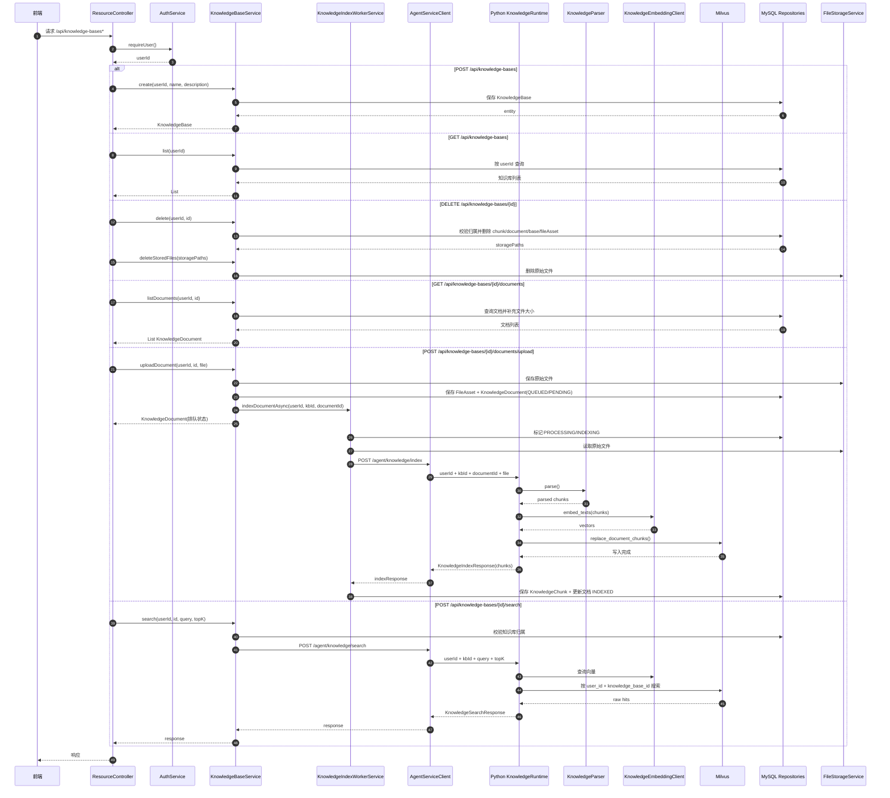

### 8.7 图库与文件接口：`GET /api/assets/images`、`GET /api/assets/videos`、`POST /api/assets/videos*`、`GET /api/assets/files*`

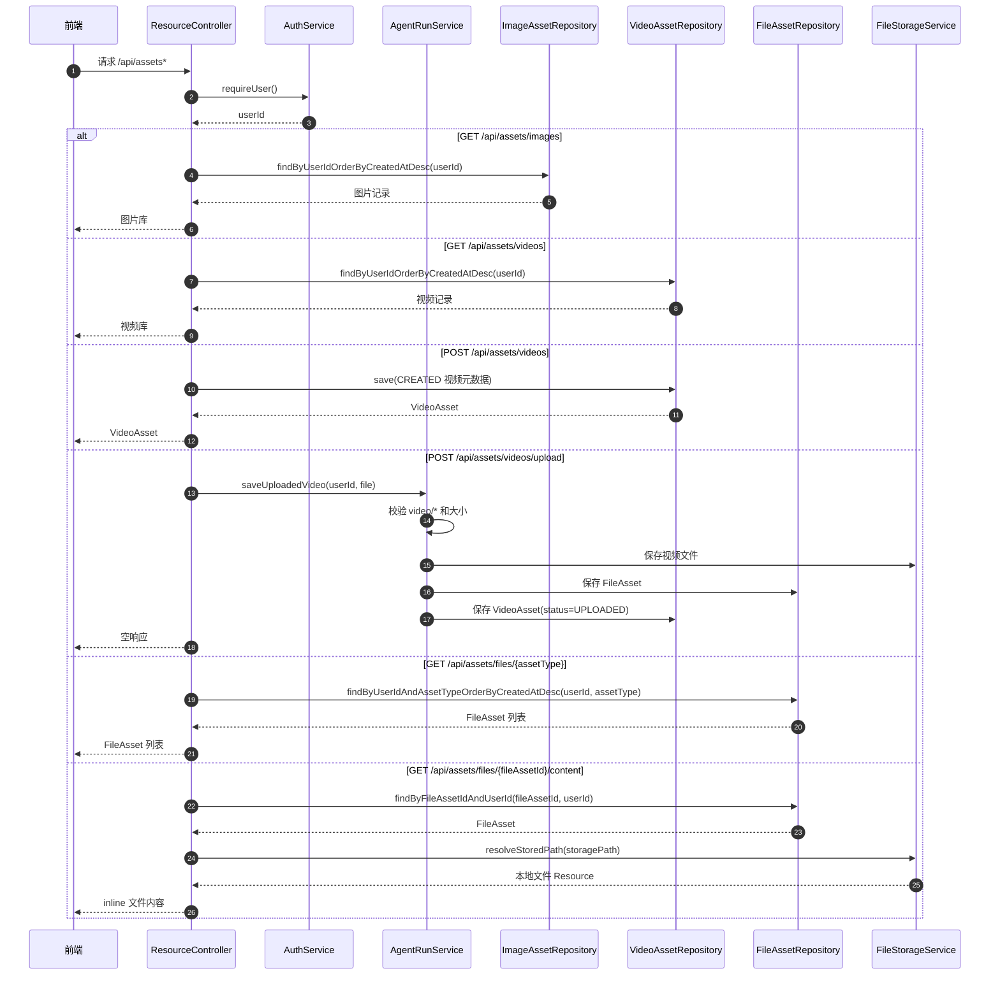

### 8.8 AI Provider 接口：`/api/ai-provider-presets`、`/api/ai-providers*`

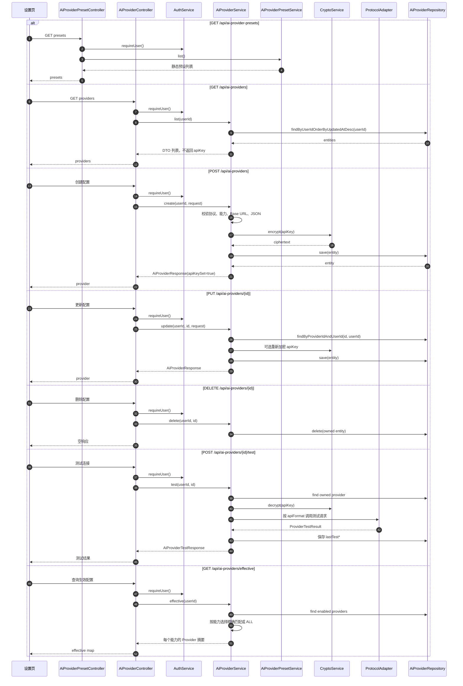

### 8.9 管理台接口：`/api/admin/*`

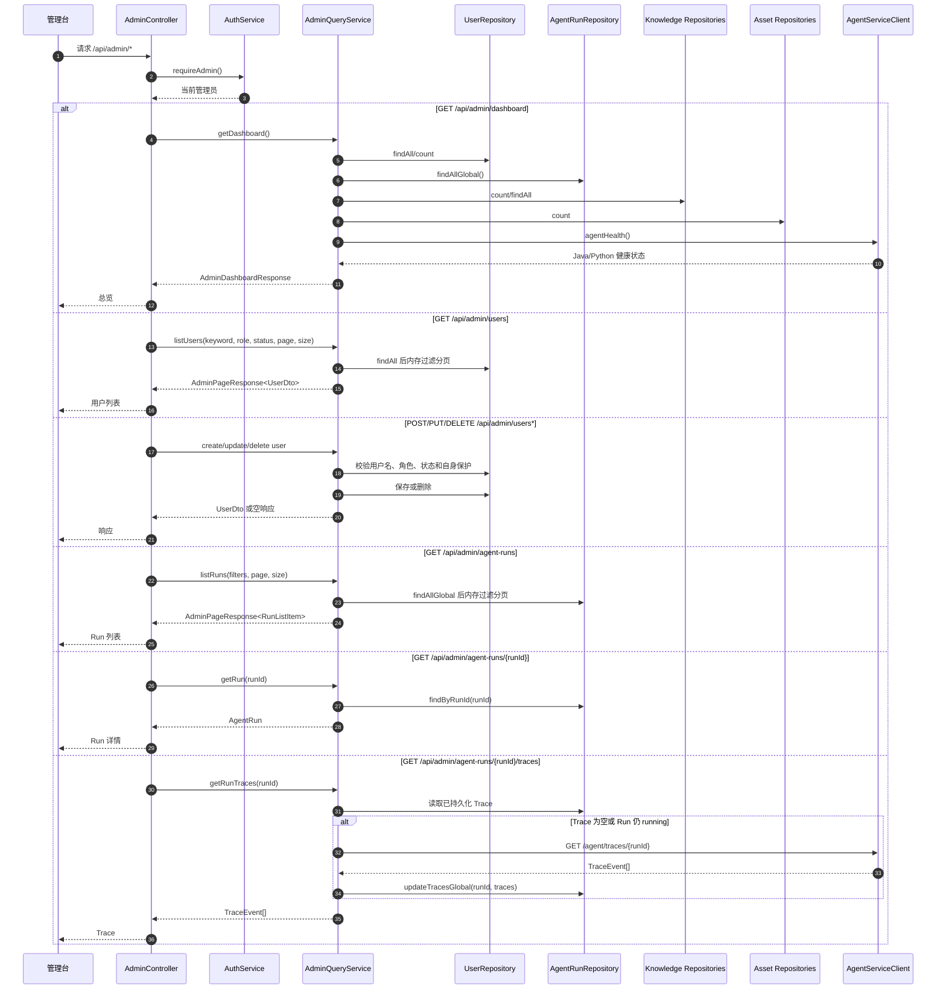

### 8.10 Python 知识库内部接口：`/agent/knowledge/*`

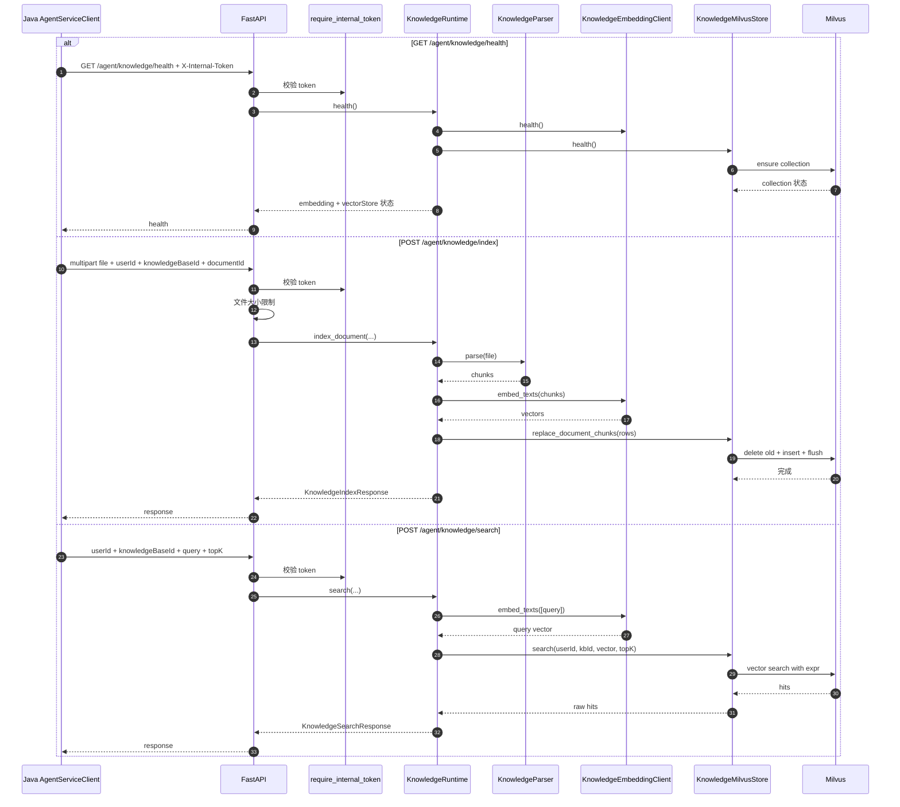

## 9. 数据与存储模型

### 9.1 MySQL 主要表

| 表 | 业务数据 | 说明 |
|---|---|---|
| `users` | 用户账号、角色、状态、密码 hash | 默认启动时创建 `admin` 和 `user`。 |
| `user_sessions` | 登录 token hash、过期和注销时间 | 用于 Bearer Token 鉴权。 |
| `conversations` | 会话标题、首条消息、最近 Run、记忆摘要 | 按 userId 隔离。 |
| `conversation_messages` | 用户和助手消息 | Run 完成后写入两条消息。 |
| `agent_runs` | Run 主信息 | 保存 capability、message、status、finalResult 等。 |
| `agent_run_details` | Run 明细 JSON | steps、toolCalls、traces、artifacts。 |
| `knowledge_bases` | 用户知识库 | 只按当前用户展示和操作。 |
| `knowledge_documents` | 文档元数据和状态 | parseStatus/indexStatus/errorReason。 |
| `knowledge_chunks` | chunk 元数据 | Java 保存文本、页码、section 和 digest，向量在 Milvus。 |
| `file_assets` | 文件资产元数据 | IMAGE、VIDEO、DOCUMENT。 |
| `image_assets` | 图片库记录 | 上传或生成记录。 |
| `video_assets` | 视频库记录 | 上传或生成记录。 |
| `ai_providers` | 外部模型供应商配置 | API Key 加密后保存。 |
| `audit_logs` | 审计日志实体 | 当前仓库已有实体和 Repository，但业务代码未写入。 |

### 9.2 文件系统

上传文件保存到配置项 `upload.storage-root-dir`，默认 `storage/uploads`。实际路径按用户和资产类型分层：

```text
storage/uploads/{safeUserId}/{image|video|document}/{fileAssetId}.{ext}
```

路径安全措施：

- `FileStorageService.store()` 会规范化路径并检查 `target.startsWith(rootDir)`。
- `resolveStoredPath()` 会拒绝空路径、非 rootDir 下路径和不存在的文件。
- 文件下载前会校验 `fileAssetId` 属于当前用户。

### 9.3 Milvus

Python 自动确保 Milvus collection 存在，默认配置：

| 配置 | 默认值 |
|---|---|
| Collection | `knowledge_chunks` |
| Vector dim | `384` |
| Metric | `COSINE` |
| Index | `IVF_FLAT` |
| nlist | `128` |
| nprobe | `10` |

Milvus 字段包含 `chunk_id`、`user_id`、`knowledge_base_id`、`document_id`、`chunk_index`、`file_name`、`section_title`、`page_no`、`content`、`vector`。检索表达式会按 `user_id` 和 `knowledge_base_id` 过滤，避免跨用户命中。

## 10. 当前代码审计结果

### 10.1 设计上已经做对的点

| 项 | 结论 |
|---|---|
| 前端访问边界 | 前端统一走 Java `/api/*`，没有直接访问 Python/Ollama/Milvus。 |
| 用户隔离 | 会话、Run、图库、知识库、Provider 多数查询都带 `userId`。 |
| 文件路径安全 | 文件保存和读取都做了 rootDir 归一化检查。 |
| API Key 保存 | 外部 Provider API Key 使用 AES-GCM 加密保存，响应 DTO 不返回明文。 |
| 知识库状态 | 文档上传和异步索引状态清晰，失败会写 `errorReason`。 |
| 运行可观测性 | Run 保存 steps、toolCalls、artifacts、traces，管理台可查看失败记录。 |
| 依赖安全意识 | `pom.xml` 中有多项 CVE 相关版本覆盖。 |

### 10.2 高优先级风险

| 等级 | 位置 | 问题 | 影响 | 建议 |
|---|---|---|---|---|
| 高 | `DataInitializer`、`README.md`、`application.yml` | 默认账号 `admin/admin123`、`user/user123` 和默认数据库密码用于本地原型。 | 如果部署到共享环境且未替换，存在直接登录风险。 | 生产环境禁用默认种子账号，首次启动强制初始化管理员密码；所有默认密码改为必须通过环境变量注入。 |
| 高 | `AuthService.hash()` | 密码使用裸 SHA-256，无盐、无慢哈希。 | 数据库泄露后密码抗破解能力弱。 | 改用 BCrypt、Argon2 或 PBKDF2，并为已有用户提供 hash 迁移策略。 |
| 高 | `agent.internal-token`、`AGENT_INTERNAL_TOKEN` | Java 和 Python 都有默认内部 token `local-dev-internal-token`。 | 内部 API 如果暴露在非本机网络，默认 token 容易被猜中。 | 生产环境启动时必须显式配置强随机 token；Python 服务绑定内网地址或加网络 ACL。 |

### 10.3 中优先级风险

| 等级 | 位置 | 问题 | 影响 | 建议 |
|---|---|---|---|---|
| 中 | `AgentRunService.createRun()` | `useKnowledgeBase=true` 且未传 `knowledgeBaseId` 时会改成 `builtin`，但 Java 仍要求用户拥有该知识库。 | API 契约与 Python 内置知识库 fallback 不一致，直接调用可能得到 `Knowledge base not found: builtin`。 | 明确去掉 `builtin` 默认值，或在 Java 层支持内置知识库分支。 |
| 中 | `AgentRunService.saveGeneratedAsset()` + `ResourceController.fileContent()` | 图片/视频生成记录的 `storagePath` 是 `mock-generated://{runId}`，文件读取接口无法解析。 | 前端如果尝试打开生成文件会失败；用户可能误解为真实媒体文件。 | 生成记录保持 metadata-only，并在 API/前端明确不可打开；接入真实媒体生成后再写入真实 FileAsset。 |
| 中 | `AgentRuntime.runs`、`AgentRunService.getTraces()` | Python Run/Trace 只存在内存；用户侧 Trace 刷新依赖 Python 内存。 | Python 重启后 Java 已持久化 Run，但刷新 Trace 可能 404 或失败。 | 用户 Trace 查询优先返回 Java 已持久化 Trace，仅在 running 或空 Trace 时尝试刷新，并对 Python 404 做降级。 |
| 中 | `FileAsset` 上传校验 | 图片/视频主要依赖 `MultipartFile.getContentType()`。 | Content-Type 可伪造，恶意文件可能进入存储。 | 增加魔数检测、扩展名白名单、文件扫描和下载安全头。 |
| 中 | `AdminQueryService.deleteUser()` | 删除用户只删 `users`，未级联清理会话、Run、文件、Provider、Session。 | 产生孤儿数据；旧 session 可能变成查无用户的异常状态。 | 改为软删除或显式事务清理相关数据；至少 revoke sessions。 |
| 中 | `AdminQueryService.listRuns()` | 全量查出后内存过滤分页，并多次按 runId 查询 userId。 | 数据量增长后管理台性能会下降。 | 改为 Repository 层分页查询和 join/projection。 |
| 中 | `AiProviderService.effective()` | 未配置外部 Provider 时 fallback 摘要硬编码 `qwen3:4b`。 | 如果环境变量换了本地模型，设置页展示与实际不一致。 | 从配置读取 `OLLAMA_MODEL` 或由 Python `/health` 返回值驱动展示。 |

### 10.4 低优先级风险与改进项

| 等级 | 位置 | 问题 | 建议 |
|---|---|---|---|
| 低 | `GlobalExceptionHandler` 与各 Controller | 错误处理分散，部分接口有局部 `@ExceptionHandler`，部分依赖全局。 | 统一错误模型、HTTP 状态码和 requestId 注入。 |
| 低 | `AuditLogEntity` | 已有审计日志表模型但没有写入逻辑。 | 管理员操作、登录、Provider 变更、知识库删除等写审计日志。 |
| 低 | `KnowledgeMilvusStore.health()` | `loaded` 字段当前更像 collection 是否存在，不是真正 load 状态。 | 如需展示加载状态，使用 Milvus 真实 load state API。 |
| 低 | 测试 | Java 只有 `contextLoads`，Python/前端无业务测试。 | 增加 Controller、Service、Provider adapter、知识库解析、能力路由测试。 |
| 低 | 前端默认登录表单 | 登录页默认填入 `user/user123`。 | 生产构建移除默认值或仅在 dev 环境启用。 |

### 10.5 当前工作区状态

本次分析时发现工作区已有未提交变更：

```text
M agent-python/app/core/llm.py
```

该文件的变更主要集中在本地意图快捷回答、系统提示词、用户提示词和会话记忆上下文格式。本文以当前工作区文件内容为准进行业务分析，未回滚或覆盖该变更。

## 11. 后续演进建议

1. 安全基线：替换密码 hash、移除默认账号/密钥、强制生产环境配置内部 token。
2. API 契约：明确「内置知识库」和「用户知识库」的边界，修复 `builtin` 与 Java 校验不一致问题。
3. 媒体生成：把当前图片/视频创作明确定位为文本方案；接入真实生成服务时补齐文件状态、下载和失败重试。
4. Trace 稳定性：用户和管理台都优先使用 Java 持久化 Trace，把 Python Trace 刷新做成非阻塞增强。
5. 管理台规模化：用户和 Run 查询下沉到数据库分页过滤，避免全量内存过滤。
6. 测试覆盖：优先补登录鉴权、Agent Run、知识库上传索引、Provider 测试和用户隔离的自动化测试。

