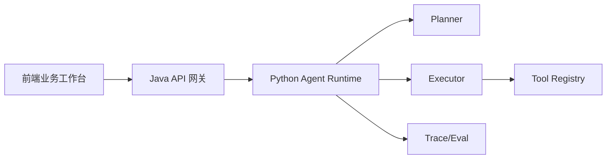

# 架构说明

## 职责边界

- 前端：负责业务操作界面和结果展示，只访问 Java `/api/*`。
- Java 后端：作为唯一 API 网关，负责校验、Run 管理、工具和 Trace 聚合。
- Python Agent：负责 Agent Runtime、Planner、Executor、Workflow、Tool Calling 和 Trace。

## 业务模块

| key | 名称 | 主要模拟能力 |
|---|---|---|
| `VIDEO_CREATION` | 视频创作 | 脚本规划、素材处理、渲染任务 |
| `ENTERPRISE` | 企业 | 企业素材检索、数字人口播文案 |
| `AI_EMPLOYEE` | AI员工 | 客户检索、建议回复、跟进任务 |
| `MATRIX_ACCOUNT` | 矩阵账号管理 | 设备检查、授权任务、Profile/Cookie 绑定 |
| `MATRIX_PUBLISH` | 矩阵视频发布 | 账号选择、素材校验、发布任务回写 |

## 禁止调用关系

- 前端不能请求 Python `:8000`。
- Python 不能承担 BFF 或页面服务职责。
- Java 不能实现 Planner、Executor 或 LLM 推理。
